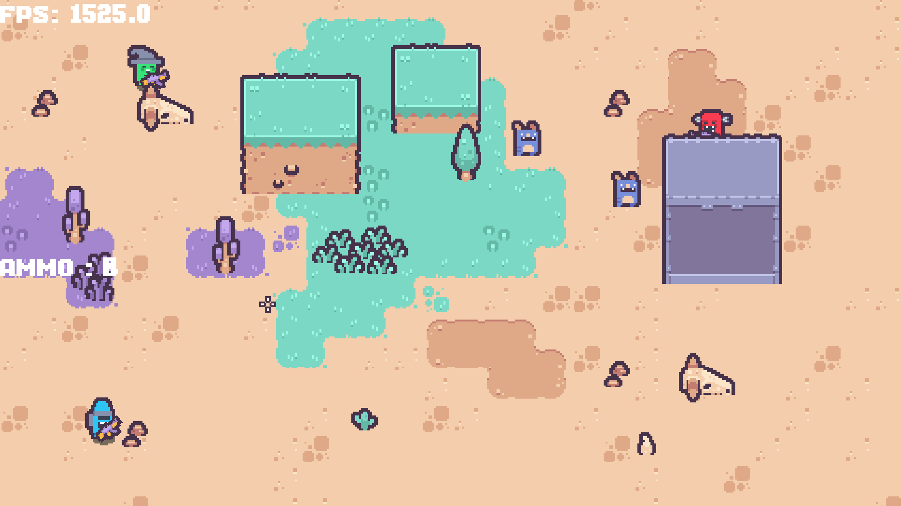

# Desert Shooter

Top-down shooter développé avec Godot 4.5 (Forward+). Projet axé sur un gameplay nerveux, un système d’armes, un bouclier directionnel et le support du multi local via manettes.

## Aperçu

- Moteur: Godot 4.5 (Forward+)
- Scène principale: `scenes/main_scene/main.tscn`
- Autoloads: `ControllerManager`, `Cursor`
- Cible: PC (clavier/souris) + manette (multi local)

## Fonctionnalités

- Bouclier directionnel (PlayerShield)
  - Arc visible et collision dynamique (taille/angle selon l’énergie restante)
  - Dégâts absorbés par "charges" avec recharge progressive et cooldown
  - Positionnement par rapport au centre du joueur (pivot configurable)
- Gestion multi-joueurs locale
  - Connexion/déconnexion de manettes à chaud
  - Mappage d’actions par joueur via `ControllerManager`
- Système d’armes (base)
  - Changement d’arme précédent/suivant
  - Tir avec gestion des projectiles (couches/masques dédiés)
- FX et ambiance
  - Particules et effets météo (pluie, neige, rayons, nuages)
- Architecture
  - Autoloads centralisés, ressources de config (`GameConfig`), états finis, séparation assets/scenes/scripts

> Note: Le projet est en cours d’évolution. Certaines fonctionnalités peuvent être partielles ou en refactor.

## Commandes par défaut

Clavier/Souris (Player 0):

- Déplacement: Z Q S D
- Dash: Espace
- Attaquer/Tirer: Clic gauche
- Bloquer/Bouclier: Clic droit
- Changer d’arme: Boutons latéraux de souris (avant/arrière)
- Recharger: R
- Viser: Curseur de la souris

Manette:

- Déplacement: Stick gauche
- Viser: Stick droit
- Tirer: Gâchette droite (RT)
- Bouclier: Gâchette gauche (LT)
- Dash: A (ou clic stick droit/R3)
- Changer d’arme: Croix droite/gauche (DPAD)

Les actions sont définies avec le préfixe `player{index}_` (ex: `player0_attack`). Les mappages manette sont générés et gérés par `ControllerManager` à la connexion des périphériques.

## Démarrer le projet

Prérequis:

- Godot 4.5 (ou supérieur compatible 4.x)

Étapes:

1. Ouvrir `project.godot` avec Godot 4.
2. Lancer le jeu (F5). La scène principale est configurée via `run/main_scene`.
3. Branche une manette si tu veux rejoindre en multi local (prise en charge à chaud).

## Structure du projet

- `assets/` — Graphismes, icônes, FX, particules, sons
- `autoload/` — Singletons (ex: `controller_manager.gd`, `cursor.tscn`)
- `resources/` — Thèmes, polices, shaders, skins
- `scenes/` — Scènes de jeu (entités, effets, menu, main)
  - `scenes/main_scene/main.tscn` — Entrée principale
  - `scenes/entities/` — Joueur, ennemis, composants (ex: bouclier)
- `scripts/` — Scripts partagés (ex: `game_config.gd`, systèmes, FSM)
- `project.godot` — Configuration du projet

## Développement

- Langage: GDScript (Godot 4)
- Style: Godot 4.x (typed GDScript recommandé)
- Entrées: configurées dans `project.godot` > `[input]` et composées dynamiquement par `ControllerManager`
- Vsync/Window: configurés dans `[display]`

### Bouclier (PlayerShield)

- Script: `scenes/entities/shield/player_shield.gd`
- Paramètres principaux (export):
  - `max_hits`, `cooldown_time`, `recharge_rate`, `recharge_delay`
  - `base_arc_angle_degrees`, `arc_radius`, `arc_segments`, `minimum_arc_ratio`
  - `offset_distance`: distance du bouclier par rapport au centre
  - `center_marker_path` (optionnel): Node2D pivot au centre du joueur
  - `center_offset` (optionnel): décalage local si pas de pivot
- Méthode: `update_orientation(direction: Vector2)` — oriente et positionne le bouclier par rapport au centre, à utiliser depuis le joueur selon la direction visée.

---

Si tu veux, je peux ajouter des captures d’écran (section "Aperçu") — place tes images dans `assets/ui/` ou `assets/` et je les référencerai dans le README.

## Assets

Kenney's Desert Shooter Pack : https://kenney.nl/assets/desert-shooter-pack 